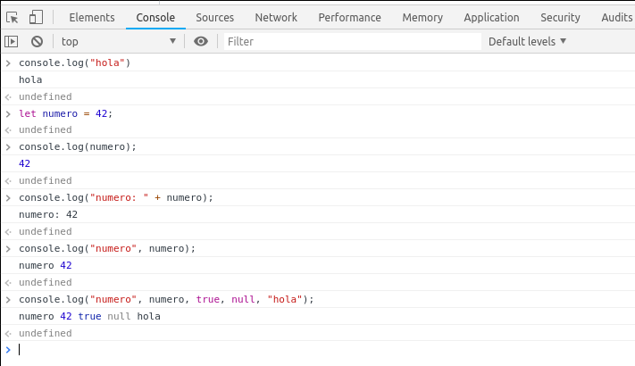
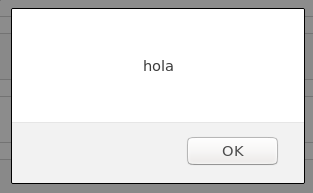
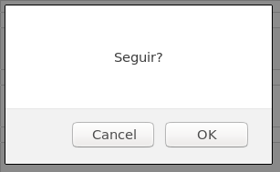
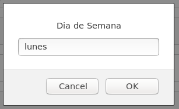

Calcular o no calcular, esa es la cuestión
==========================================

En capítulos anteriores vimos un tipo de dato llamado `bool` o `boolean` que puede
tomar dos valores, verdadero (true) o falso (false), los cuales son el
resultado de operaciones lógicas y de comparación.

En el siguiente capitulo vimos como hacer cálculos, ahora vamos a unir estos
dos conceptos usando el resultado de comparaciones y operaciones lógicas para
decidir que calculamos y que no, para eso vamos a introducir una nueva
expresión llamada *if*, pero antes veamos un ejemplo.

Vas a poner el despertador, **si** "el día es un día de semana", **entonces** pones
el despertador a las 8, **sino** lo dejas apagado.

Esto lo podríamos expresar en javascript así:

.. code-block:: javascript

    if (esDiaDeSemana) {
        ponerDespertador(8);
    }

Esta es la versión mas simple, en la cual escribimos la palabra clave **if**,
luego entre paréntesis la condición que va a evaluar a verdadero o falso, luego
entre llaves las expresiones que queremos evaluar si la condición es verdadera.

Ese ejemplo asume que el despertador esta apagado, por lo que no necesitamos
hacer nada si `esDiaDeSemana` es falso.

Pero que pasa si queremos apagarlo por las dudas este prendido, no queremos
despertarnos temprano por accidente un sábado!

Entonces podemos usar otra palabra clave, veamos un ejemplo:

.. code-block:: javascript

    if (esDiaDeSemana) {
        ponerDespertador(8);
    } else {
        apagarDespertadorSiEstaPrendido();
    }

En este caso, después de la llave de cierre escribimos la palabra clave
**else** que significa "sino" y entre llaves las expresiones a evaluar si la
condición en el **if** es falsa.

Podemos imaginar que el código de `apagarDespertadorSiEstaPrendido` es algo como:

.. code-block:: javascript

    if (despertadorPrendido) {
        apagarDespertador();
    }

Con esto podemos hacer muchísimas cosas, pero si tu semana es variada y tenes
que despertarte a horas distintas según el día, vas a necesitar tener mas de
una condición, veamos como seria eso uniendo las dos palabras claves que ya
aprendimos y pongamos todo en una función.

.. code-block:: javascript

    function configurarDespertador(diaDeSemana) {
        if (diaDeSemana === "lunes" || diaDeSemana === "miércoles") {
            ponerDespertador(8);
        } else if (diaDeSemana === "martes" || diaDeSemana === "viernes") {
            ponerDespertador(7);
        } else {
            apagarDespertadorSiEstaPrendido();
        }
    }

Antes de describir la función por completo, notar que para tener una segunda
condición a comprobar después del primer **if**, escribimos la palabra clave
**else** seguida de la palabra clave **if**, esto se leería algo así como::

    si (condicion1) entonces
        ejecutar bloque1
    sino si (condicion2) entonces
        ejecutar bloque2
    sino
        ejecutar bloque3.

Definimos la función configurarDespertador que recibe como parámetro el diaDeSemana,
y con el tenemos 3 bloques que podemos evaluar:

* Si es lunes o miércoles: despertador a las 8
* Si es martes o viernes: despertador a las 7
* sino, asegurarse que el despertador este apagado

Si te fijas, el despertador no va a sonar los fines de semana ni el miércoles,
cuando escribimos condiciones complejas o encadenadas hay que fijarse bien que
estamos probando todos los casos.

Para poder probar esto con código completo y ver si tomamos la decisión
correcta vamos a aprender dos formas de mostrar al usuario de nuestra
aplicación el resultado.

Mostrando texto en la consola de desarrolladores con `console.log`.

Durante el desarrollo nos puede pasar que queremos saber por donde se ejecuto
el código o cual es el valor de una variable, para eso podemos usar el objeto
`console` que tiene algunas funciones útiles, la mas útil de ellas es la
función `log`.

Abrí una pagina cualquiera, abrí las herramientas de desarrollo (usualmente F12
la abre), abrí el tab "Consola" (o nombre similar) si no esta abierto en ese,
si ves muchas cosas ahí hace click en el icono del tacho de basura para
limpiar la consola y escribí:

.. code-block:: javascript

    console.log("hola");

Y apretá enter, deberías ver que la linea siguiente dice "hola", probemos
algunos otros ejemplos:

.. code-block:: javascript

    let numero = 42;
    console.log(numero);
    console.log("numero: " + numero);
    console.log("numero", numero);
    console.log("numero", numero, true, null, "hola");

A mi me quedo así:

Podrás notar que `console.log` recibe tantos parámetros como deseemos y los
muestra a todos, no hay necesidad de juntarlos todos en un solo valor de tipo
texto.

El objeto console tiene otras funciones útiles, proba alguno de los ejemplos
anteriores reemplazando la función log con `warn`, `error`, `info`.

.. code-block:: javascript

    console.warn(numero);
    console.error("numero: " + numero);
    console.info("numero", numero);

Con esto podemos "simular el despertador", sin tener que escribir todo ahora,
solo vamos a imprimir que haría.

Pero antes de ir a eso, vamos a ver otra forma de mostrar información, que
si bien es simple y medio molesta es una buena herramienta cuando estamos
empezando un proyecto.

Como existe el objeto `console`, que tiene varias funciones relacionadas a la
consola de desarrollo, existe el objeto `window` que tiene funciones
relacionadas a la ventana donde esta nuestra pagina, la cantidad de funciones
que tiene es impresionante, pero por ahora nos vamos a enfocar en solo tres, la
función `alert`, que nos permite mostrar un mensaje al usuario, la función
`confirm` que nos permite mostrar un mensaje al usuario y el usuario puede
responder el clásico "OK" o "Cancelar" y la función `prompt` que nos permite
preguntar algo y el usuario puede responder con texto o cancelar.

Empecemos por la mas fácil, `alert`:

.. code-block:: javascript

    window.alert("hola");
    let numero = 42;
    window.alert("numero: " + numero);

A diferencia de `console.log`, `window.alert` recibe un solo parámetro, si
queremos mostrar el valor de múltiples variables tenemos que juntarlas en un
solo valor de tipo texto.

Veamos `window.confirm`:

.. code-block:: javascript

    let respuesta;
    // responde una de las dos opciones
    respuesta = window.confirm("Seguir?");
    console.log('Respuesta', respuesta);

    // responde la otra
    respuesta = window.confirm("Seguir?");
    console.log('Respuesta', respuesta);

la función devuelve `true` si se selecciono "OK" y `false` si se selecciono
"Cancel".

Por ultimo `window.prompt`, el cual recibe dos parámetros, el primero es el
mensaje a mostrar, el segundo es el valor por defecto para el campo de texto,
si no lo especificamos empieza con el texto vació.

.. code-block:: javascript

    // selecciona "Cancel"
    respuesta = window.prompt("Día de Semana", "lunes");
    console.log('Respuesta', respuesta);

    // selecciona "OK"
    respuesta = window.prompt("Día de Semana", "lunes");
    console.log('Respuesta', respuesta);

La función devuelve `null` si se selecciono "Cancel" y el texto en el campo de
texto si se selecciono "OK".

Probemos combinándolas un poco:

.. code-block:: javascript

    let r1 = window.confirm("Seguir?");
    if (r1) {
        window.alert(":)");
    } else {
        window.alert(":(");
    }

El código te va a preguntar si querés seguir, si respondes OK va a mostrar :),
si respondes cancel va a mostrar :(.

Una nota por si estas probando y te da este error o algo parecido::

    SyntaxError: redeclaration of let nombreDeVariableAca

Eso es porque declaraste dos veces la misma variable, las variables se declaran
una sola vez por función con `let`, acá estamos en la consola, así que es como
una función eterna que ejecuta cada linea que le damos, así que solo tenemos
que declarar la variable una vez, después simplemente se siguen usando, sin
tener que declararla de nuevo.

Veamos como usaríamos la función `window.prompt` para configurar nuestro
despertador:

.. code-block:: javascript

    let r2;
    r2 = window.prompt("Día", "lunes");
    if (r2 === null) {
        window.alert("Acción cancelada");
    } else {
        configurarDespertador(r2);
    }

Acá estamos llamando a `configurarDespertador`, que definimos mas arriba solo
si el usuario ingreso un día y apretó OK.

La función `configurarDespertador` llama a un par de funciones que todavía no
definimos, así que si probas este código te va a dar un error diciendo que
`apagarDespertadorSiEstaPrendido` o `ponerDespertador` no están definidas,
por ahora vamos a usar `window.alert` y una variables globales para simular el
despertador.

Acá va todo el código junto.

.. code-block:: javascript

    // una variable global (fuera de las funciones) para saber si el despertador
    // esta prendido o no, inicializado a false, indicando que esta apagado
    let despertadorPrendido = false,
        // variable global para saber a que hora esta puesta la alarma
        horaDespertador = 0;

    function preguntarDiaYPonerDespertador() {
        let respuesta = window.prompt("Día", "lunes");

        if (respuesta === null) {
            window.alert("Acción cancelada");
        } else {
            configurarDespertador(respuesta);
        }
    }

    function configurarDespertador(diaDeSemana) {
        if (diaDeSemana === "lunes" || diaDeSemana === "miércoles") {
            ponerDespertador(8);
        } else if (diaDeSemana === "martes" || diaDeSemana === "viernes") {
            ponerDespertador(7);
        } else {
            apagarDespertadorSiEstaPrendido();
        }
    }

    function prenderDespertadorSiEstaApagado() {
        // si no esta prendido
        if (!despertadorPrendido) {
            // lo prendemos
            despertadorPrendido = true;
            console.log('despertador prendido');
        } else {
             console.log('despertador ya estaba prendido');
        }
    }

    function apagarDespertadorSiEstaPrendido() {
        // si esta prendido
        if (despertadorPrendido) {
            // lo apagamos
            despertadorPrendido = false;
            console.log('despertador apagado');
        } else {
            console.log('despertador ya estaba apagado');
        }
    }

    function ponerDespertador(hora) {
        prenderDespertadorSiEstaApagado();
        console.log('nueva hora para despertador', hora);
        horaDespertador = hora;
    }

Te recomiendo que escribas el código en lugar de copiar y pegarlo, de esa forma
te vas a ir acostumbrando a escribir los paréntesis, llaves y puntos y coma en
su lugar y a entender los errores cuando te equivocaste en algo.

Luego de declarar las variables y funciones llama `preguntarDiaYPonerDespertador();`
y proba con distintos días varias veces viendo que se imprime en la consola.

Como ejercicio queda comprobar que el día ingresado es un día valido, sino
informarlo con `window.alert` y no intentar configurar el despertador.

Como ayuda, te recomiendo que declares una nueva función `esDiaValido`, que
uses `if` y `else if` para comprobar que el día pasado como parámetro es un día
valido, si lo es devolvé `true` (`return true;`), en el `else` devolvé `false`
(`return false;`).
