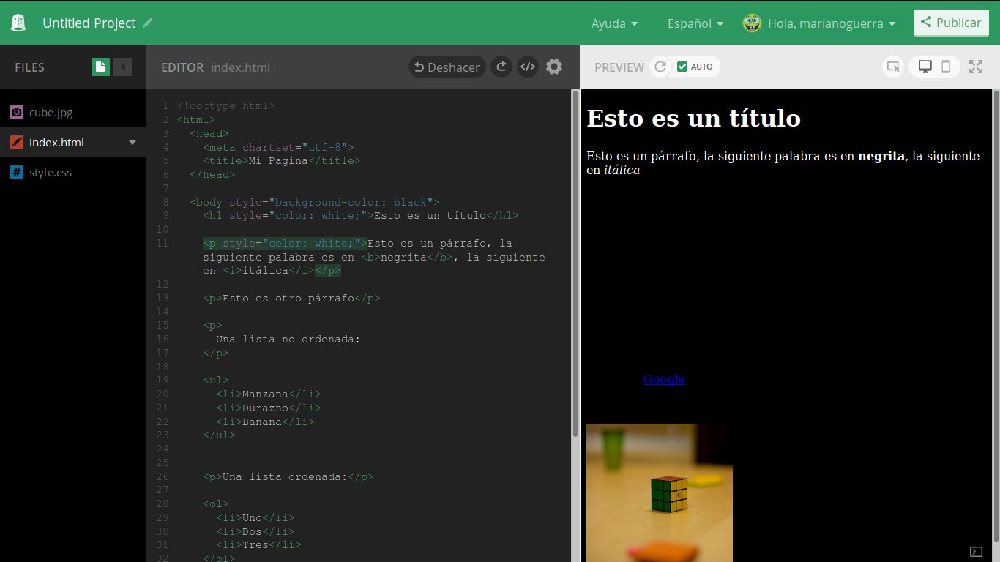
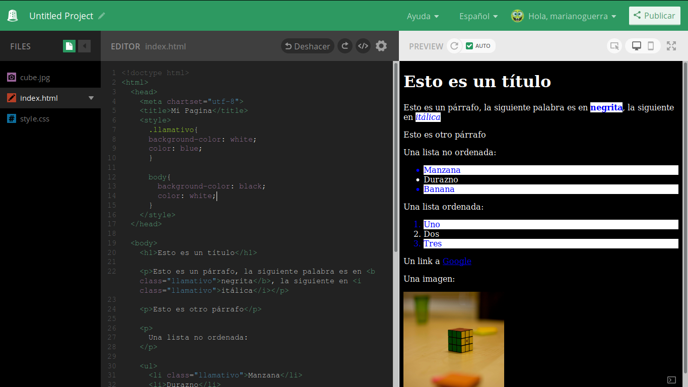

CSS y cosas por el estilo
=========================

En la sección previa vimos como usar HTML para definir la estructura y el
contenido de nuestras paginas web, pero seamos sinceros, el aspecto deja
bastante que desear.

Para poder hacer nuestras paginas mas agradables vamos a aprender el segundo
lenguaje: CSS, el cual sirve para describir el aspecto y disposición del
contenido que definamos con HTML.

Apagando las luces
------------------

Vamos a empezar cambiando un poco de color, que pasa si queremos hacer una
pagina "invertida"? donde el fondo es oscuro y el texto claro.

Creemos un proyecto nuevo con el siguiente contenido:

.. code-block:: html

	<!doctype html>
	<html>
	  <head>
		<meta charset="utf-8">
		<title>Mi Pagina</title>
	  </head>

	  <body>
		<h1>Esto es un título</h1>

		
Esto es un párrafo, la siguiente palabra es en <b>negrita</b>, la siguiente en <i>itálica</i>

		
Esto es otro párrafo

		

		  Una lista no ordenada:
		

		<ul>
		  <li>Manzana</li>
		  <li>Durazno</li>
		  <li>Banana</li>
		</ul>

		
Una lista ordenada:

		<ol>
		  <li>Uno</li>
		  <li>Dos</li>
		  <li>Tres</li>
		</ol>

		
Un link a <a href="https://google.com">Google</a>

		
Una imagen:

		
	  </body>
	</html>

Para empezar tenemos que hacer que el fondo sea oscuro, es decir el cuerpo
(body) de la pagina debe tener el color de fondo negro.

Como le decimos a un tag cosas que no son su contenido?

Con atributos, en este caso el atributo es bastante poderoso, y su valor es un lenguaje en si mismo!

Cambiamos el tag de apertura del cuerpo de

.. code-block:: HTML

	  <body>

A:

.. code-block:: HTML

	  <body style="background-color: black;">

El contenido del atributo style es uno o mas pares de valores, cada par separado
por **;**, cada par a su lado izquierdo tiene la "llave" y del lado derecho el "valor".

Este concepto de pares llave valor se va a repetir mucho en el mundo informático
así que si prestas atención lo vas a ver en muchos lados, para empezar, ya los
conocés de los atributos de los tags :)

Los pares llave/valor en CSS sirven para especificar distintas propiedades del
tag en el que están definidos.

En este caso le estamos diciendo que el color de fondo `background-color <https://developer.mozilla.org/es/docs/Web/CSS/background-color>`_ (background significa
fondo en ingles) tiene el valor negro (black).

El resultado, si bien es lo que queremos, nos agrega un nuevo desafío:

.. figure:: ../galleries/cew/4/01-bg-color.png

	El texto no se lee!

Ahora tenemos que hacer que el texto sea un color claro, empezamos con el titulo:

.. code-block:: HTML

		<h1 style="color: white;">Esto es un título</h1>

Para definir el color del contenido de un tag (no el fondo), usamos la llave
`color <https://developer.mozilla.org/es/docs/Web/CSS/color>`_ (que por suerte no tenemos que traducir :)

Continuamos con el primer párrafo:

.. code-block:: HTML

	
Esto es un párrafo, la siguiente palabra es en <b>negrita</b>, la siguiente en <i>itálica</i>

Y el resultado se ve algo así:

Si sos como yo, ya estarás pensando: "Esto va a llevar un buen tiempo y mucha repetición!".

Si, eso pensé yo.

Pero quizás notaste que la palabra **negrita** y la palabra *itálica* ahora
también tienen color blanco.

Esto no es un accidente, cuando un valor se define en CSS para un tag, los tags
descendientes "heredan" ese valor si tiene sentido, el color de fondo y el
color del texto por suerte son unos de ellos.

Ahora bien, donde podríamos poner el color de texto para hacer el menor esfuerzo posible?

En el mismo lugar que definimos el color de fondo.

.. code-block:: HTML

	  <body style="background-color: black; color: white;">

El resultado es lo que esperábamos:

.. figure:: ../galleries/cew/4/03-color.png

Gustos específicos
------------------

Ahora digamos que se nos ocurre que queremos que la palabra **negrita**,
*itálica* y los elementos impares de las listas tienen que tener fondo blanco y
texto rojo.

Intentemos lo:

.. code-block:: HTML

	<!doctype html>
	<html>
	  <head>
		<meta charset="utf-8">
		<title>Mi Pagina</title>
	  </head>

	  <body style="background-color: black; color: white;">
		<h1>Esto es un título</h1>

		
Esto es un párrafo, la siguiente palabra es en <b style="background-color: white; color: red;">negrita</b>, la siguiente en <i style="background-color: white; color: red;">itálica</i>

		
Esto es otro párrafo

		

		  Una lista no ordenada:
		

		<ul>
		  <li style="background-color: white; color: red;">Manzana</li>
		  <li>Durazno</li>
		  <li style="background-color: white; color: red;">Banana</li>
		</ul>

		
Una lista ordenada:

		<ol>
		  <li style="background-color: white; color: red;">Uno</li>
		  <li>Dos</li>
		  <li style="background-color: white; color: red;">Tres</li>
		</ol>

		
Un link a <a href="https://google.com">Google</a>

		
Una imagen:

		
	  </body>
	</html>

Eso fue bastante repetitivo...

Gustos específicos, cambiantes
------------------------------

En este momento se nos ocurre que quizás seria mejor si el texto fuera azul en
lugar de rojo.

La idea de tener que cambiar el color en cada lugar nos hace pensar que quizás
el rojo esta bien después de todo...

Pero como siempre en el mundo de la web, si algo es repetitivo y tedioso,
seguro hay una forma de automatizar lo repetitivo.

En este caso lo que nos serviría es indicar todos los tags que comparten un
conjunto de características y especificar en un mismo lugar las características
comunes.

Es como si los tags pertenecieran a una misma clase.

Y resulta que todos los tags pueden tener un atributo para eso, el atributo
`class <https://developer.mozilla.org/es/docs/Web/HTML/Atributos_Globales/class>`_ nos permite definir una lista de palabras separadas por espacios que
describen a que clases pertenece ese tag.

Llamemos a nuestra clase de tags con fondo claro y texto colorido **llamativo**.

Edita el ejemplo, todos los elementos con `style="background-color: white; color: red;"` ahora tienen que contener el atributo **class** con el valor **llamativo**, ejemplo del primero:

.. code-block:: html

	<b class="llamativo">negrita</b>

Luego de hacer todos los cambios podemos observar que ... no paso nada.

Porque las clases son cosas que usamos nosotros para agrupar tags, ahora
tenemos que de alguna forma decirle al navegador que queremos que todos los
tags con clase **llamativo** tengan fondo blanco y texto azul.

Para eso vamos a aprender un tag nuevo, el tag `style <https://developer.mozilla.org/es/docs/Web/HTML/Elemento/style>`_, este tag normalmente va en
la cabecera (porque no define contenido del documento) y nos permite
centralizar en un lugar las definiciones de estilo.

Este va a ser el principio del documento:

.. code-block:: html

	<!doctype html>
	<html>
	  <head>
		<meta charset="utf-8">
		<title>Mi Pagina</title>
		
	  </head>

La parte que nos interesa y es nueva es el contenido del tag

.. code-block:: css

		.llamativo{
			background-color: white;
			color: blue;
		}

El nombre de nuestra clase esta ahí, pero empieza con un punto?

Si, para decirle al navegador que **llamativo** es una clase de tags en nuestro documento.

Luego de decir para que cosa queremos definir el estilo, llamado *selector* en
la jerga **CSS** (ya que selecciona el conjunto de tags a los cuales el estilo
aplica) le decimos que estilo aplicar, en nuestro caso y de la misma forma que
en el atributo style, pares de llave/valor separados por **;**. Por suerte acá
podemos separarlos con saltos de linea y espacios para hacerlo mas legible.

Que pasa si no ponemos el punto? el navegador piensa que nos referimos al
nombre de un tag, veamos un ejemplo.

.. code-block:: css

		.llamativo{
			background-color: white;
			color: blue;
		}

		body{
			background-color: black;
			color: white;
		}

Y así podemos centralizar todo el estilo de la pagina en la cabecera y separar
claramente el contenido de su presentación, algo que es una buena costumbre en
el desarrollo web.

Gustos cambiantes, en muchos lugares
------------------------------------

Con lo que aprendimos hasta ahora ya podrías tener tu pagina personal, tu blog
o una pagina con cuentos o historias.

Imaginemos que con el tiempo tu pagina web crece y tiene 10 documentos distintos,
todos con el mismo estilo en la cabecera.

Y un día decidís cambiar el estilo de tu pagina, querés algo mas claro.

Ahí es cuando dándote cuenta que vas a tener que hacer cambios en 10 documentos, el estilo oscuro actual no es tan mala idea después de todo...

A menos que haya otra forma de evitar la repetición.

Por suerte la hay, y quizás ya la notaste al ver en tus proyectos de Thimble un
archivo con un nombre familiar que todavía no mencionamos.

El misterioso **style.css**.

Si lo abrís vas a ver un contenido familiar con algunas cosas nuevas, el mio tiene esto:

.. code-block:: css

	/* Fonts from Google Fonts - more at https://fonts.google.com */
	@import url('https://fonts.googleapis.com/css?family=Open+Sans:400,700');
	@import url('https://fonts.googleapis.com/css?family=Merriweather:400,700');

	body {
	  background-color: white;
	  font-family: "Open Sans", sans-serif;
	  padding: 5px 25px;
	  font-size: 18px;
	  margin: 0;
	  color: #444;
	}

	h1 {
	  font-family: "Merriweather", serif;
	  font-size: 32px;
	}

Con lo que aprendimos e ignorando las primeras dos lineas podemos ver que es un
archivo que contiene CSS y que define el estilo para el tag body y para los
títulos.

Pero ese estilo no se esta aplicando, porque no lo incluimos en nuestro
documento.

Para incluirlo vamos a aprender un tag nuevo, que hace muchas cosas distintas
pero su tarea habitual es incluir archivos de estilo en documentos HTML.

Si agregamos el siguiente tag:

.. code-block:: html

	<link href="style.css" rel="stylesheet">

Después del tag *style* en la cabecera podemos ver como de pronto el estilo
contenido en ese archivo se aplica al documento!

Antes de ver que sucedió y donde esta nuestro fondo negro veamos los dos
atributos del tag `link <https://developer.mozilla.org/es/docs/Web/HTML/Elemento/link>`_:

href
	Atributo que indica la ubicación del archivo de estilo a cargar, ya lo conocíamos del tag *a*

rel
	Como vimos mas arriba, *link* es un tag polifacético, y para saber cual es la **rel** acion del archivo referenciado con el actual, se lo tenemos que indicar.
	En este caso le decimos que la relación es de una hoja de estilo (**S** tyle **s** heet), de ahí las dos *s* en CSS

Ahora tendrás una de dos preguntas, o las dos:

Y nuestro fondo oscuro?

Y la C en CSS que significa?

Resulta que las dos preguntas tienen mas o menos la misma respuesta, la C en
CSS es de Cascada, osea que CSS en español significa hojas de estilo en
cascada.

Y donde esta la cascada? en la forma en la que el navegador interpreta los
estilos que definimos para nuestro documento.

En nuestro documento primero le decimos que el fondo del tag body es negro y
después cargamos un archivo CSS que le dice que el fondo es claro.

El navegador interpreta los estilos dándole la razón al ultimo que lo declaro y
al mas especifico.

En este caso, el ultimo en declarar el color de fondo del documento es el archivo (esta mas abajo en el documento HTML).

Y lo de mas especifico? bueno, el color del texto esta definido en varios lugares,
en el tag style para el tag body, y en el archivo style.css para el tag body. en ese caso sabemos que el ultimo gana.

Pero sin embargo los tags con clase **llamativo** son azules, como decide el
navegador que el azul le gana al negro? Porque el atributo class es mas
especifico que el tag body.

De esta manera podemos hacer definiciones generales "a grandes rasgos" al
principio de nuestras hojas de estilo e irlas refinando mas abajo,
redefiniendolas para casos mas particulares e incluso en otras hojas de estilo
especificas para ciertos documentos.

Esto es bastante información y con el tiempo lo vamos a ir aprendiendo a medida
que lo usamos.

Pero antes de terminar, movamos nuestro estilo al archivo style.css y dejemos
el documento HTML libre de CSS mas que la referencia a style.css, el cual queda
así:

.. code-block:: css

	body {
	  background-color: white;
	  color: #444;

	  font-family: helvetica;
	  font-size: 18px;

	  padding: 5px 25px;
	  margin: 0;
	}

	h1 {
	  font-size: 32px;
	}

	.llamativo{
	  background-color: white;
	  color: blue;
	}

En el CSS hay algunas llaves nuevas, font-family define la fuente del texto,
font-size su tamaño, las otras dos (padding y margin) las vamos a ver en
próximas secciones.

El principio de nuestro documento queda así:

.. code-block:: html

	<!doctype html>
	<html>
	  <head>
		<meta charset="utf-8">
		<title>Mi Pagina</title>
		<link href="style.css" rel="stylesheet">
	  </head>

Ya observaras uno de los beneficios de separar contenido de presentación:
cambiamos completamente el aspecto de la pagina sin tocar su contenido.

El proyecto quedo así:

