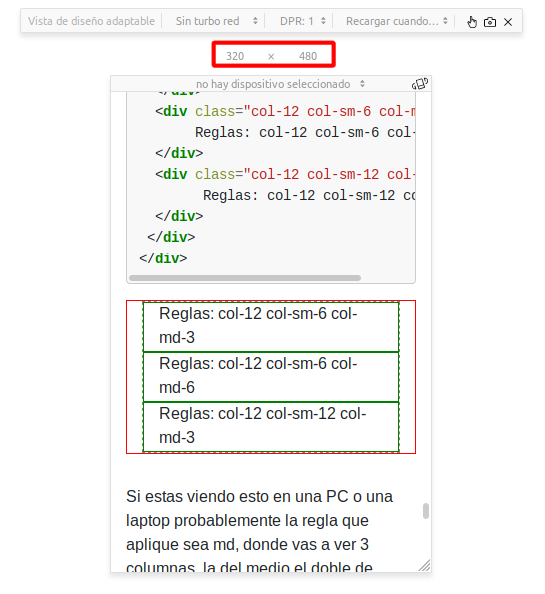

Filas, columnas y pantallas de todos los tamaños
================================================

Hasta ahora hemos creado paginas con HTML donde el documento tiene una
estructura básica: una cosa debajo de la otra.

Si prestas atención a sitios que visitas notaras que la estructura de esas
paginas es mas complejas, la forma principal de organizarlas es con filas y
columnas.

El lenguaje HTML provee algunos tags para indicar la intención del contenido
dentro de esos tags pero no provee la estructura en si misma, para eso usamos
CSS, el tema con los atributos CSS para definir estructura es que son muy
específicos y flexibles, la idea es que con ellos podamos lograr cualquier tipo
de estructura que deseemos, pero con gran flexibilidad viene gran complejidad.

Por esta razón han surgido distintas librerías CSS que permiten describir la
estructura de un documento en términos mas generales (lo que los hace menos
flexibles) pero de una forma que sirven para la mayoría de los casos que
necesitamos.

Esta sección va a explorar como usar bootstrap para definir la estructura de
nuestra pagina.

Vocabulario
-----------

Cuando definimos la estructura de un documento con bootstrap las palabras que
aparecen son las siguientes:

Contenedor (container en ingles)
    La raiz de una estructura con filas y columnas, podemos tener contenedores
    dentro de columnas pero no es algo común
Fila (row en ingles)
    Una sección horizontal dentro de un contenedor o dentro de una columna
Columna (col/column en ingles)
    Una sección vertical dentro de una fila
Puntos de corte (breakpoints en ingles)
    Limites de resolución horizontal en la cual ciertas reglas cambian de
    significado (si, suena vago, vamos a ver esto en detalle luego)

Empezando
---------

Estructura básica
-----------------

Vamos a empezar con el ejemplo mas básico, un contenedor que tiene una fila
que tiene una columna.

.. raw:: html

    

.. code-block:: html

    

     

      

        Columna 1
      

     

    

Nada raro, simplemente esta estructura definida con divs y clases:

* container

  + row

    - col

Agregue una clase cew-9 a container-fluid para poder resaltar los distintos tags con
css ya que si no lo hago es difícil percibir la estructura, los colores son los
siguientes:

* container-fluid: rojo
* row: gris y blanco
* col: verde

.. raw:: html

    

     

      

        Columna 1
      

     

    

Usamos la clase `container-fluid` para que el contenedor se estire el 100% del
ancho del tag que lo contiene, la clase `container` puede ser usada cuando
queremos mas control sobre el ancho del contenedor.

Dos columnas
------------

Un paso mas, dos columnas, que ya es algo que nos permite replicar bastantes
estructuras encontradas en la web.

.. code-block:: html

    

     

      

        Columna 1
      

      

        Columna 2
      

     

    

.. raw:: html

    

     

      

        Columna 1
      

      

        Columna 2
      

     

    

La estructura es

* container

  + row

    - col 1
    - col 2

Normalmente en la web encontramos esta estructura de dos columnas pero donde
una de ellas es una especie de menú o contenido secundario y la otra es el
contenido principal, por lo cual el contenido principal usa mas espacio.

Para poder indicar esto de una forma que se adapte a todas las resoluciones de pantalla bootstrap define que una fila puede estar dividida en 12 "columnas", si no
lo indicamos cada columna toma una cantidad igual de esas 12 columnas, por lo
que si tenemos una columna tomara las 12, si tenemos 2 cada una tomara 6.

En nuestro caso queremos que la segunda sea la columna principal, por lo que le
vamos a indicar que queremos que tome 8 de esas 12 columnas.

.. code-block:: html

    

     

      

        Columna 1
      

      

        Columna 2
      

     

    

.. raw:: html

    

     

      

        Columna 1
      

      

        Columna 2
      

     

    

Para hacerlo cambiamos la clase `col` por la clase `col-8` que indica que
queremos que tome 8 de las 12 columnas disponibles.

Dos columnas con cabecera y pie de pagina
-----------------------------------------

Esta estructura es la mas común para blogs o artículos, arriba tenemos una
cabecera que ocupa todo el ancho con logo, titulo, navegación y algunas otras
cosas, luego el contenido en si con dos columnas, luego un pie de pagina con
información extra.

.. code-block:: html

    

     

      

       Cabecera
      

     

     

      

        Columna 1
      

      

        Columna 2
      

     

     

      

       Pie de pagina
      

     

    

.. raw:: html

    

     

      

       Cabecera
      

     

     

      

        Columna 1
      

      

        Columna 2
      

     

     

      

       Pie de pagina
      

     

    

La estructura queda así:

* container

  + row (cabecera)

    - col (contenido de cabecera)

  + row (cuerpo)

    - col 1 (contenido secundario)
    - col 2 (contenido principal)

  + row (pie de pagina)

    - col (contenido de pie de pagina)

Tortugas hasta el fondo
-----------------------

::

	Un célebre científico dio una conferencia sobre astronomía.
	Describió cómo la Tierra gira alrededor del Sol y cómo éste, a su vez,
	gira alrededor de un inmenso conjunto de estrellas al que llamamos nuestra galaxia.

	Al final de la conferencia, una vieja señora se levantó del fondo de la sala y dijo:

	- Todo lo que nos ha contado son disparates.
	  En realidad, el mundo es una placa plana que se sostiene sobre el caparazón
	  de una tortuga gigante

	El científico sonrió con suficiencia antes de replicar:

	- ¿Y sobre qué se sostiene la tortuga?
	- Sobre el caparazón de otra torguta gigante. -respondió la señora
	- ¿Y qué sostiene a esa otra tortuga? volvió a preguntar el científico.
	- Se cree usted muy agudo, joven, dijo la anciana,
	  pero hay tortugas hasta el fondo.

Como hacemos si queremos tener una columna que a su vez tiene su propia estructura?

Podemos tener filas dentro de columnas.

.. code-block:: html

    

     

      

       Cabecera
      

     

     

      

        Columna 1
      

      

       

        

         Columna 2.1.1
        

        

         Columna 2.1.2
        

       

       

        

         Columna 2.2.1
        

        

         Columna 2.2.2
        

        

         Columna 2.2.3
        

       

      

     

     

      

       Pie de pagina
      

     

    

.. raw:: html

    

     

      

       Cabecera
      

     

     

      

        Columna 1
      

      

       

        

         Columna 2.1.1
        

        

         Columna 2.1.2
        

       

       

        

         Columna 2.2.1
        

        

         Columna 2.2.2
        

        

         Columna 2.2.3
        

       

      

     

     

      

       Pie de pagina
      

     

    

La estructura queda así:

* container

  + row (cabecera)

    - col (contenido de cabecera)

  + row (cuerpo)

    - col 1 (contenido secundario)
    - col 2 (contenido principal)

    * row 2.1

      - col 2.1.1
      - col 2.1.2

    * row 2.2

      - col 2.2.1
      - col 2.2.2
      - col 2.2.3

  + row (pie de pagina)

    - col (contenido de pie de pagina)

Resoluciones de pantalla
------------------------

Con este nuevo conocimiento creamos una pagina con una estructura perfecta
para la pantalla que estamos usando y orgullosamente la compartimos con gente
para que la vean, el primer mensaje que recibimos es:

::

	- No se ve bien en mi celular, todo es muy chico y con poco espacio

No pensamos en que la pagina va a ser vista por personas usando un smartphone
viejo, uno de ultima generación, una tablet, una laptop chica, una grande,
una PC y la pantalla de un diseñador con mas pixeles de los que podemos contar.

Como hacemos para que nuestra pagina se adapte a la resolución de cualquier
dispositivo que quiera visitar nuestra pagina?

Una idea seria ver cuales son las resoluciones mas comunes en pixeles y aplicar
reglas para esos, si bien eso funcionaba en la prehistoria de la web (esto es,
hace 10 años), ya no es así, veamos algunas de las resoluciones mas comunes
disponibles actualmente:

.. figure:: ../galleries/cew/9/resoluciones.png
	:align: center

Intentando hacer esto manejable entran en juego los `puntos de corte` que
mencionamos al principio del articulo.

Los puntos de corte son limites de resolución que agrupan a la resolución de los
dispositivos en 5 grandes grupos, similares a los de la ropa:

* xs: Extra Small

  + Extra pequeño, dispositivos con menos de 576 pixeles de ancho

* sm: Small

  + Pequeño, dispositivos con menos de 768 pixeles de ancho

* md: Medium

  + Medio, dispositivos con menos de 992 pixeles de ancho

* lg: Large

  + Grande, dispositivos con menos de 1200 pixeles de ancho

* xl: Extra Large

  + Extra Grande, dispositivos con 1200 pixeles de ancho o mas

Como los usamos? indicando el ancho de la columna con el tipo de dispositivo
mínimo para el cual el tamaño aplica, entonces podemos decir algo como:

"Esta columna ocupa 12 columnas si es una resolución xs y 6 si no"

lo expresamos en clases: `.col-12 .col-sm-6`

O mas complejas como

"Esta columna ocupa 12 columnas si es una resolución xs, 8 si es una resolución sm y 6 si no"

lo expresamos en clases: `.col-12 .col-sm-8 .col-md-6`

Control completo si especificamos todas:

"Esta columna ocupa 12 columnas si es una resolución xs, 8 si es una resolución sm, 6 si es una resolución md, 4 si es lg y 2 si es xl"

lo expresamos en clases: `.col-12 .col-sm-8 .col-md-6 .col-lg-4 .col-xl-2`

Bootstrap va a buscar el grupo mas cercano a la resolución actual y aplicar esa
regla, si nuestro dispositivo tiene una resolución de 1000 pixeles y hay una
regla para md (< 992px) va a aplicar esa, sino va a buscar la regla sm y sino
la xs.

Probemos un ejemplo:

.. code-block:: html

    

     

      

	   Reglas: col-12 col-sm-6 col-md-3
      

      

	   Reglas: col-12 col-sm-6 col-md-6
      

      

	    Reglas: col-12 col-sm-12 col-md-3
      

     

    

.. raw:: html

    

     

      

	   Reglas: col-12 col-sm-6 col-md-3
      

      

	   Reglas: col-12 col-sm-6 col-md-6
      

      

	    Reglas: col-12 col-sm-12 col-md-3
      

     

    

Si estas viendo esto en una PC o una laptop probablemente la regla que aplique
sea md, donde vas a ver 3 columnas, la del medio el doble de ancho que las
laterales.

Pero como probamos para distintas resoluciones sin tener disponibles dispositivos
para cada punto de corte?

En Firefox en el menú `Herramientas > Desarrollador web > Vista de diseño adaptable` o el atajo de teclado `Ctrl+Shift+M`

.. figure:: ../galleries/cew/9/firefox-ctrl-shift-m.png
	:align: center

En Chrome en el menú `Menú > Mas Herramientas > Herramientas para desarrolladores` y al abrirse seleccionamos el segundo icono de arriba a la derecha o el atajo de teclado `Ctrl+Shift+M`

.. figure:: ../galleries/cew/9/chrome-ctrl-shift-m.png
	:align: center

Esto va a abrir una herramienta que nos permite simular distintas resoluciones
y ver como la pagina se adapta a los cambios, lo único que vamos a usar ahora
es cambiar la resolución manualmente o elegir un dispositivo predeterminado.

Así es como se ve en mi computadora en firefox:

    Resolución xs: 320x480

.. figure:: ../galleries/cew/9/ff-sm.png
    :align: center

    Resolución sm: 760x480

    Resolución md: 800x480

Te recomiendo que lo pruebes vos, actividad extra, navega por paginas que visites
frecuentemente con esta herramienta abierta, fijate como se adapta (o no) a
la resolución que elegiste.
