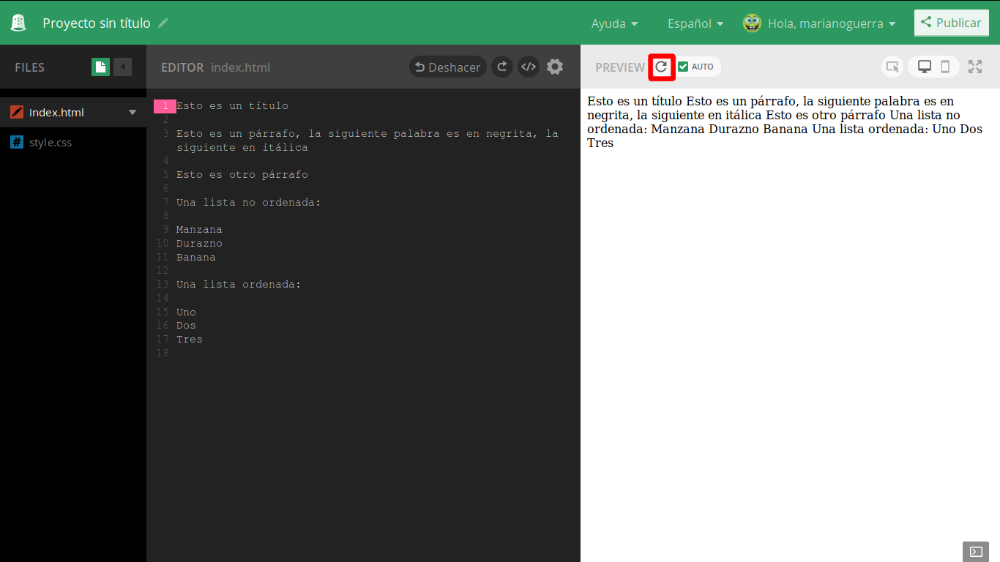
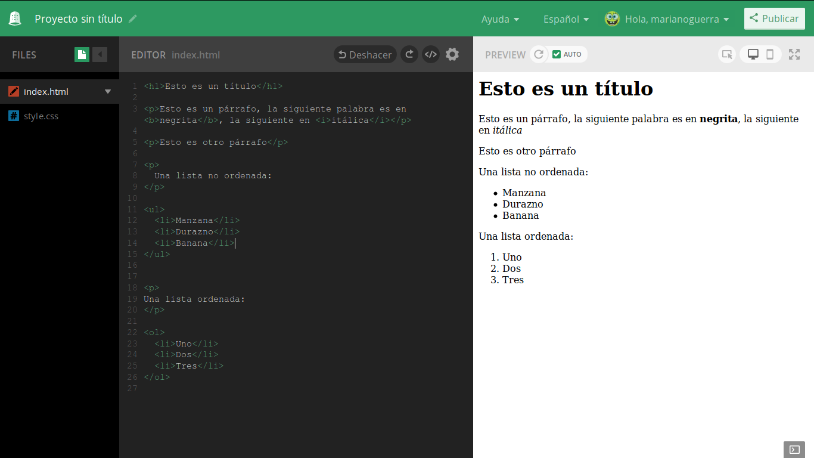

HTML
====

Crear paginas web involucra normalmente 3 "lenguajes" (formas que tenemos los humanos de decirle a una computadora que queremos que haga).

El único necesario es el que vamos a cubrir en esta sección: HTML

HTML permite describir el contenido de una pagina web que un programa especial
llamado normalmente navegador web interpreta y muestra en la pantalla.

El contenido de un archivo HTML es texto con un formato especial, pero que podemos
inspeccionar y editar con cualquier editor de texto.

Normalmente cuando la gente quiere crear un documento de texto que tenga cierto
formato usa un programa como Microsoft Word, Google Docs o Libre Office Writer,
en estos programas le indicamos con acciones al editor que partes del texto tienen
que formato, algo como lo siguiente:

.. figure:: ../galleries/cew/2/01-editor-visual.gif
	:align: center

Para indicarle al editor que una linea es un titulo, la seleccionamos, demarcando
los limites y luego le indicamos que queremos que se muestre como un titulo.

Los párrafos simplemente los separamos con saltos de linea, si queremos texto
en negrita o itálica, al igual que con el titulo, seleccionamos e indicamos que
formato queremos para la selección.

HTML es un lenguaje que inicialmente fue pensado para escribir en editores de
texto y luego evoluciono para ser generado por programas, que toman datos de
una base de datos y generan como salida texto en formato HTML.

Si bien existen algunos editores visuales para HTML, normalmente este se edita
a mano con editores de texto, y eso es lo que vamos a hacer.

La pagina mas simple del mundo
------------------------------

Escribí lo siguiente en la barra de dirección de tu navegador:

.. code-block:: html

    data:text/html, hola mundo

Felicitaciones! acabas de crear tu primera pagina web!

Normalmente lo que escribimos en la barra de direcciones del navegador es la
ubicación de la pagina web, la primera parte (http: o https:) le indica al
navegador que lo que sigue es la ubicación de la pagina que queremos ver y que
la puede solicitar usando el "protocolo" [1]_ HTTP (Protocolo de Transferencia
de Hiper Texto), lo que sigue es la dirección de la pagina, similar a la
ubicación de un archivo en tu computadora, pero empezando con la pagina web que
contiene la pagina.

En este caso le decimos que le vamos a indicar la pagina directamente, y que
esta en formato HTML, luego escribimos el contenido de la misma.

Si bien no es una forma ideal de crear paginas web, a veces es útil para tareas
especificas, por ejemplo:

Selector de colores:

.. code-block:: html

    data:text/html, <input type="color">

Calendario:

.. code-block:: html

    data:text/html, <input type="date">

Bloc de notas:

.. code-block:: html

    data:text/html, <body contenteditable style="max-width:60rem;margin:0 auto;padding:4rem;">bloc de notas

No te preocupes por la parte `style="max-width:60rem;margin:0 auto;padding:4rem;"` eso es el segundo lenguaje que vamos a ver en la próxima sección.

Nuestra primera pagina web
--------------------------

Nuestra primera pagina web va a intentar replicar el ejemplo de Google Docs que
vimos mas arriba, con esta pagina vamos a cubrir los principales elementos de
HTML.

Empezamos creando un nuevo proyecto en Thimble, si tenes dudas de como hacerlo
revisa la sección anterior que contiene una introducción a Thimble.

El nuevo proyecto comienza con un contenido por defecto:

.. code-block:: html

	<!DOCTYPE html>
	<html>
	  <head>
		<meta charset="utf-8">
		<meta name="viewport" content="width=device-width, initial-scale=1">
		<title>Made with Thimble</title>
		<link rel="stylesheet" href="style.css">
	  </head>
	  <body>
		<h1>Welcome to Thimble</h1>
		

		  Make something <strong>amazing</strong> with the web!
		

	  </body>
	</html>

Lo vamos a borrar y escribir el siguiente texto:

.. code-block:: html

	Esto es un título

	Esto es un párrafo, la siguiente palabra es en negrita, la siguiente en itálica

	Esto es otro párrafo

	Una lista no ordenada:

	Manzana
	Durazno
	Banana

	Una lista ordenada:

	Uno 
	Dos
	Tres

El resultado debería ser similar al siguiente:

Si la vista previa no se actualiza automáticamente podes hacer click en el
botón de refrescar vista previa.

Como podemos ver la vista previa muestra todo el texto junto y sin formato, algo así::

	Esto es un título Esto es un párrafo, la siguiente palabra es en negrita, la siguiente en itálica Esto es otro párrafo Una lista no ordenada: Manzana Durazno Banana Una lista ordenada: Uno Dos Tres 

Sin formato es esperable ya que no le indicamos ninguno, pero porque todo junto?

Porque HTML "junta" todos los espacios y saltos de lineas a un solo espacio, si queremos especificar algo distinto lo tenemos que hacer explícitamente.

Esto nos va a permitir estructurar el documento con claridad y estructura sabiendo
que el navegador no va a reflejar nuestros espacios y saltos de linea en el documento final.

Ya tenemos el contenido de nuestra primera pagina web, es un avance! pero no
es muy diferente a un documento de texto, como agregamos el formato?

En el ejemplo de Google Docs mas arriba para indicar el formato de las
distintas partes lo que hacíamos era indicar el principio y el fin de la
sección a la que le queriamos aplicar formato con el mouse y luego
seleccionamos una operación en el menú para indicarle que tipo de formato
queremos.

En HTML es casi igual, salvo que no tenemos mouse ni menú :)

Como HTML es un formato de texto, tenemos que trabajar con lo que tenemos,
pero la forma es muy parecida, primero indicamos el principio y final de una
sección a la que le queremos aplicar una operación y luego le indicamos cual es
esa operación.

En HTML el indicador para el inicio de una sección es <> y el indicador de fin es </>

Pero eso no funciona porque todavía tenemos que indicar que operación aplicar al texto entre <> y </>, para eso escribimos la operación entre el < y el >.

Empecemos con el titulo, si notas en la animación de Google Docs, la operación se llama **Heading 1**, es medio largo para escribir todo eso cada vez que queremos un titulo de nivel 1, así que lo acortamos a `h1`.

Cambiemos

.. code-block:: html

	Esto es un título

Por

.. code-block:: html

	<h1>Esto es un título</h1>

El resultado debería verse algo así:

.. figure:: ../galleries/cew/2/03-h1.png

Tenemos el titulo!

Y ese es el primer **tag** (etiqueta en inglés) que aprendimos:

h1
	Formatea el texto delimitado como un titulo de nivel 1

Si digo titulo de nivel 1 podemos imaginarnos que hay mas niveles, es como
el indice de un libro, las secciones tienen sub secciones y cada sección tiene
un titulo de un nivel mas alto.

En HTML tenemos 6 niveles: h1, h2, h3, h4, h5, h6.

Continuemos.

La siguiente linea dice:

.. code-block:: html

	Esto es un párrafo, la siguiente palabra es en negrita, la siguiente en itálica

Como le indicamos que es un párrafo? como con el titulo, lo rodeamos de una etiqueta de apertura y una de cierre y le indicamos que es un párrafo, pero de nuevo, escribir párrafo en español o ingles por cada párrafo es bastante largo así que lo vamos a abreviar a **p**

.. code-block:: html

	
Esto es un párrafo, la siguiente palabra es en negrita, la siguiente en itálica

El resultado debería verse similar al siguiente:

.. figure:: ../galleries/cew/2/04-p.png

Notaras que ahora el primer párrafo tiene espacio con respecto al titulo y al
resto del texto, ahora hacemos lo mismo con los siguientes párrafos:

.. code-block:: html

	<h1>Esto es un título</h1>

	
Esto es un párrafo, la siguiente palabra es en negrita, la siguiente en itálica

	
Esto es otro párrafo

	

	  Una lista no ordenada:

	Manzana
	Durazno
	Banana
	

	

	Una lista ordenada:

	Uno 
	Dos
	Tres
	

Como veras los saltos de linea y los espacios no afectan el formato final.

.. figure:: ../galleries/cew/2/05-p.png

Tenemos el titulo y los párrafos, ya casi que podemos escribir un cuento en HTML :)

Pero un poco mas de formato no vendría mal, sigamos con negrita e itálica.

No hay nada de magia, es igual a las anteriores, rodeamos la sección que queremos
formatear y le indicamos que formato queremos aplicarle.

A ver si te podes imaginar que identificador lleva negrita (**b** old en ingles)
e itálica (**i** talic en ingles)?

.. code-block:: html

	
Esto es un párrafo, la siguiente palabra es en <b>negrita</b>, la siguiente en <i>itálica</i>

El resultado debería verse algo así:

Como podes ver en el párrafo, podemos tener tags/etiquetas dentro de otros tags/etiquetas, en este caso tenemos tags negrita e itálica dentro del tag de párrafo.

Ya casi estamos!

Solo faltan las listas, en este caso tenemos que indicar dos cosas distintas con tags:

1. Que queremos una lista

	* Ordenada: Numerada
	* No Ordenada: Sin Numeración

2. Cuales son los elementos de la lista

Empecemos con la lista no ordenada, en ingles **u** nordered **l** ist, ya te podes imaginar como se identifica el tag:

.. code-block:: html

	<ul>
	Manzana
	Durazno
	Banana
	</ul>

Pero esto no es suficiente, todavía le tenemos que decir cuales son los elementos de la lista (**l** ist **i** tem en ingles):

.. code-block:: html

	<ul>
		<li>Manzana</li>
		<li>Durazno</li>
		<li>Banana</li>
	</ul>

De nuevo tenemos tags dentro de otro tag, en este caso el tag **li** (list
item) dentro del tag **ul** (unordered list)

Para la lista ordenada es igual, pero en lugar de indicar que queremos una lista
no ordenada, le indicamos que queremos una ordenada (**o** rdered **l** list en ingles)

.. code-block:: html

	<ol>
		<li>Uno</li> 
		<li>Dos</li>
		<li>Tres</li>
	</ol>

El código completo:

.. code-block:: html

	<h1>Esto es un título</h1>

	
Esto es un párrafo, la siguiente palabra es en <b>negrita</b>, la siguiente en <i>itálica</i>

	
Esto es otro párrafo

	

	  Una lista no ordenada:
	

	<ul>
	  <li>Manzana</li>
	  <li>Durazno</li>
	  <li>Banana</li>
	</ul>

	
Una lista ordenada:

	<ol>
	  <li>Uno</li> 
	  <li>Dos</li>
	  <li>Tres</li>
	</ol>

Que debería verse similar a esto:

Y con esto replicamos el documento de Google Docs y sabemos un poco mas cual es
el contenido de los archivos .doc, .odt y similares, solo que esos están en
formato binario (unos y ceros) ya que las computadoras los prefieren en lugar
del formato texto, que preferimos los humanos :)

.. [1] Un protocolo es un acuerdo entre dos o mas partes que establece la forma en la que se van a comunicar, en este caso establece como un navegador solicita un documento HTML y como el otro se lo envía.

