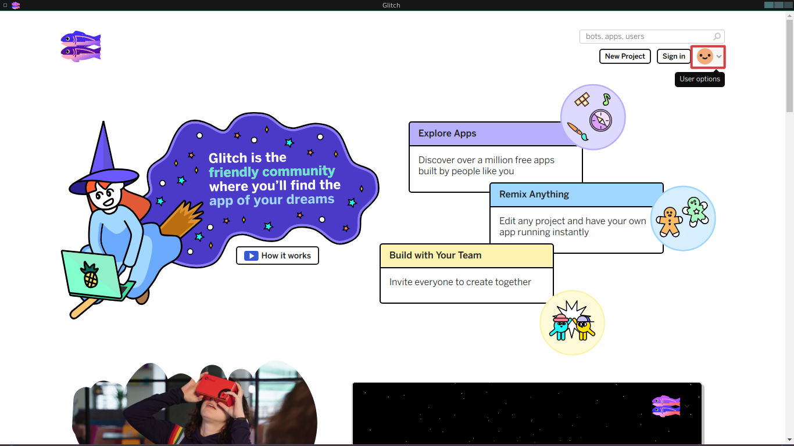

Introducción
============

Nota: En el pasado este capitulo y varios de los siguientes se basaban en una
herramienta llamada thimble, por desgracia mozilla decidió cerrarla en 2019 así
que tuve que migrar la guiá a una herramienta que se llama glitch, la cual es
mas potente que thimble pero no esta traducida al castellano y le faltan
algunas cosas que hacían a thimble una buena herramienta para principiantes.
Aun así, vamos a intentar hacer lo mejor posible para que esas diferencias no
generen ningún problema.

Este es el primero de lo que espero sera una serie de artículos sobre como
aprender a hacer paginas web para personas sin ningún conocimiento previo de
tecnología o programación.

Si sabes de tecnología recomendaselo a la mayor cantidad de personas posible,
no sabemos cuantas grandes diseñadoras y programadoras web se encuentran
escondidas por ahí.

Si te recomendaron esto y pensás que no es para vos, la cuestión es que si es
para vos, y si algo es confuso no es tu culpa, es miá, así que contactame y
decime que parte no esta clara así mejoramos esta guiá para todas.

Este articulo es una introducción a la herramienta que vamos a usar para los
siguientes ejemplos, un proyecto llamado `Glitch <https://glitch.com>`_, el
cual facilita el proceso de crear, compartir y remixar paginas.

Lo primero que vamos a necesitar hacer es crear una cuenta en Glitch, visitando
https://glitch.com, vamos a ver algo similar a la siguiente imagen:

Click en la carita de arriba a la derecha va a desplegar un menú con varias
opciones, podes autenticarte con facebook si querés, con github si tenes una
cuenta o con una dirección de correo, yo voy a cubrir esta ultima ya que
facebook es mas simple y no creo que tengas una cuenta de github (aun ;)

Hace click en el link **Sign in**

.. figure:: ../galleries/cew/1/03-sign-in-email.png

Luego hace click en **Sign in with Email**

.. figure:: ../galleries/cew/1/04-email-input.png

Ingresa tu dirección de correo en la caja de texto que aparece y hace click en **Send Link**

Te va a llegar un correo con un botón y una palabra clave, hace click en el
botón, si por alguna razón querés usar la palabra clave en el menú anterior
hace click en **Use a sign in code**.

Escribí o copia y pega la palabra clave del mail que recibiste en la caja de
texto y hace click en **Sign In**.

Cualquiera de las dos debería llevarte a una pagina similar a esta:

.. figure:: ../galleries/cew/1/07-user-landing.png

La cual va a estar mas vaciá ya que yo ya use glitch para los ejemplos de esta guiá.

Para crear un nuevo proyecto hace click en el botón **New Project** arriba a la derecha:

.. figure:: ../galleries/cew/1/08-landing-new-project.png

Esto va a desplegar una lista de proyectos base, elegí el primero
**hello-webpage** que es un proyecto con una pagina web de ejemplo:

El nuevo proyecto debería cargar y verse similar a lo siguiente:

.. figure:: ../galleries/cew/1/10-new-project-readme.png

A la izquierda tenes un listado de archivos del proyecto, veamoslos uno por uno:

assets
    Una carpeta (o directorio) vació donde podemos poner archivos que querramos
    en nuestra pagina, como imágenes, videos, sonidos u otro tipo de archivos.

README.md
    Un archivo muy usado en proyectos, que describe a grandes rasgos de que se
    trata y como se usa, la extensión .md indica que se trata de un archivo en
    formato `Markdown <https://es.wikipedia.org/wiki/Markdown>`_ el cual es muy
    parecido a texto plano pero que muchas aplicaciones saben interpretar para
    agregar formato de una manera simple.

    Este archivo explica la estructura del proyecto en ingles, podes editarlo
    haciendo click en el botón **Markdown** con el ojo arriba de **Welcome to
    Glitch**, que cambia entre vista previa y modo de edición.

index.html
    Un archivo que describe el contenido de la pagina, es el primer archivo que
    vamos a editar en el siguiente capitulo.

style.css
    Un archivo que define el aspecto de la pagina, es el segundo archivo que
    vamos a editar dentro de un par de capítulos.

script.js
    Un archivo que define las interacciones que son posibles en la pagina, por
    ejemplo, que hacer cuando el usuario de la pagina hace click en un botón,
    es el ultimo archivo que vamos a editar.

Podemos ver nuestra pagina en vivo haciendo click en el botón **Show Live**
arriba a la izquierda.

El cual nos va a mostrar una similar a esta:

Felicitaciones! publicaste tu primera pagina web, podes compartirla copiando la
dirección de la barra de direcciones.

Mas adelante vamos a necesitar subir imágenes para agregarlas a nuestra pagina,
para eso seleccionamos la carpeta **assets** en el listado de la izquierda, el
cual nos muestra su contenido a la derecha, actualmente vació.

.. figure:: ../galleries/cew/1/14-assets.png

Para agregar un archivo hacemos click en el botón **Add asset** y luego en el
botón **Upload** lo cual va a abrir un dialogo de selección de archivos, elegí
alguna imagen para subir.

.. figure:: ../galleries/cew/1/15-add-asset-upload.png

Después de subirla deberías poder verla en el directorio **assets**:

Si queremos editar los datos del proyecto como el titulo, la descripción o bien
crear un nuevo proyecto o remixar el existente tenemos que hacer click en el
nombre del proyecto arriba a la izquierda, glitch genera un nombre aleatorio a
cada proyecto nuevo, así que el tuyo se va a ver distinto al mio:

.. figure:: ../galleries/cew/1/17-project-options.png

Para renombrar el proyecto (lo que va a cambiar la dirección donde esta
publicado también), hacemos click en el nombre actual y escribimos el nuevo.

Para editar la descripción hacemos doble click en la descripción actual y
escribimos la nueva:

Si estamos en un proyecto y queremos crear una copia para hacerle cambios sin
perder el actual hacemos click en el botón **Remix Project**:

.. figure:: ../galleries/cew/1/20-remix.png

Probemos hacer nuestro primer cambio, abrí el archivo **index.html** haciendole
click en la lista de la izquierda, debería mostrar su contenido a la derecha,
ignora todas las partes que no entiendas, busca por el texto **Hi there!**, en
mi proyecto esta en la linea 16 (fijate que a la izquierda cada linea tiene un
numero).

Cambia **Hi there!** por **Hola mundo!**:

.. figure:: ../galleries/cew/1/22-edit-title.png

Si no tenes la vista previa abierta (que debería recargarse sola), hace click
en **Show Live**, vas a ver que la pagina ahora dice **Hola mundo!**:

.. figure:: ../galleries/cew/1/23-new-preview.png

Felicitaciones, editaste tu primera pagina!

Empecemos en el siguiente capitulo a entender un poco mas que son esas cosas
raras en el archivo index.html.
