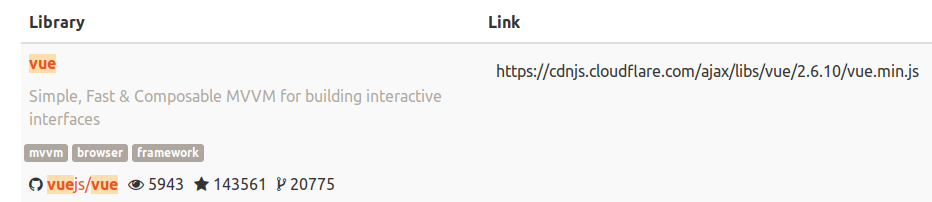

Estructura de un proyecto real
==============================

Hasta ahora hemos usado herramientas online para probar nuestros proyectos, en
este capitulo vamos a ver como crear un proyecto completo en nuestra
computadora.

Para empezar necesitamos crear una carpeta para nuestro proyecto, yo le voy a
llamar `miapp` pero el nombre puede ser cualquiera que prefieras.

Para crear una carpeta hace click derecho en la carpeta donde querés crear tu
proyecto y elegí del menú "Nueva Carpeta" o similar, renombrala a gusto y entra
a la carpeta haciendole doble click.

Ahora necesitamos crear nuestro `index.html`, el archivo de entrada de nuestra
aplicación, podes crearlo desde tu editor de texto preferido, si no tenes uno
podes probar instalar `notepad++ <https://notepad-plus-plus.org/>`_ si estas en
Windows y querés un editor liviano pero potente, si estas en linux fijate si
tenes instalado `gedit`, `kedit` o `kate`, podes buscarlos escribiendo "editor"
en el lanzador de aplicaciones.

Si querés algo mas potente podes instalar `Visual Studio Code <https://code.visualstudio.com/>`_, va a tomar un poco mas de tiempo acostumbrarse a el y consume mas recursos pero es un editor completo usado por una gran parte de los programadores.

Volviendo a nuestro `index.html`, podes crearlo haciendo click derecho en la carpeta de proyecto y eligiendo "Nuevo Archivo" o similar y renombrandolo a `index.html` o podes crear un archivo nuevo desde tu editor y elegir "Guardar Como" y nombrarlo `index.html` en la carpeta de tu proyecto.

El contenido de `index.html` va a ser:

.. code-block:: html

   <!doctype html>
   <html>
     <head>
       <meta charset="utf-8">
       <meta name="viewport" content="width=device-width, minimum-scale=1.0, initial-scale=1, maximum-scale=1.0, user-scalable=no">
       <meta http-equiv="x-ua-compatible" content="ie=edge">
       <title>Mi App</title>
       
       
       <link rel="stylesheet" href="css/bootstrap.css" media="all"/>
       <link rel="shortcut icon" href="img/favicon.png">
     </head>
     <body>
       

          
Contador: {{count}}

          <button @click="count = count + 1">Incrementar</button>
       

     </body>
   </html>

Ahora dentro de la carpeta del proyecto crea los siguientes directorios:

js
   donde vamos a escribir nuestro código javascript
lib
   donde vamos a poner archivos javascript de otros que vamos a usar
css
   donde vamos a poner nuestro código CSS
img
   donde vamos a poner imagenes y otros archivos que necesitemos

Abri tu navegador y visita https://cdnjs.com/ en la barra de búsqueda de la pagina escribí "vue" te va a aparecer algo parecido a esto:

Hace click en el botón "Copy" que aparece a la derecha cuando acercas el mouse, abrí una pestaña nueva y pega la dirección
(tecla Control y tecla v a la vez o click derecho y "Pegar"), apretá enter y te
va a aparecer algo no muy legible, no importa, en el menú de tu navegador anda
a "Archivo" y "Guardar pagina como" (o similar), elegí el directorio `lib` dentro
de tu proyecto y nombra el archivo `vue.js`.

Este procedimiento sirve para cualquier otra biblioteca de funcionalidad que
quieras usar en tu proyecto, guardas el archivo en el directorio lib y agregas
el tag `script` en `index.html`, podes también poner la dirección directamente
en el tag `script` como hemos hecho antes, solo que de esta forma podes
programar incluso cuando no tenes acceso a internet.

Hagamos lo mismo con `bootstrap <https://getbootstrap.com/>`_ anda a https://getbootstrap.com/ hace click en "Download", baja hasta la sección "BootstrapCDN", copia la dirección en el primer tag, en mi caso es "https://stackpath.bootstrapcdn.com/bootstrap/4.3.1/css/bootstrap.min.css", pegala en la barra de direcciones y guardala dentro del directorio `css` de tu proyecto como `bootstrap.css`.

Crea un archivo llamado `app.js` en el directorio `js`, pone el siguiente
contenido dentro:

.. code-block:: js

   function main() {
      let app = new Vue({
         el: '#app',
         data: {count: 0}
      });
   }

   // llamar a la funcion main cuando la pagina termine de cargar
   window.addEventListener('load', main);

Ahora para poder abrir nuestra aplicación en el navegador necesitamos un
"servidor" web que le provea los archivos al navegador cuando este los pida,
vamos a usar un servidor simple con una herramienta que vamos a necesitar de
todas formas en los siguientes pasos.

Abrí tu navegador y visita https://nodejs.org/es/ hace click en el botón de
descarga y seguí las instrucciones del instalador.

una vez instalado crea un archivo llamado `miserver.js` en el directorio del
proyecto con el siguiente contenido:

.. code-block:: js

   var http = require('http');
   var fs = require('fs');
   var path = require('path');

   http.createServer(function (request, response) {
       console.log('request ', request.url);

       var filePath = '.' + request.url;
       if (filePath == './') {
	   filePath = './index.html';
       }

       var extname = String(path.extname(filePath)).toLowerCase();
       var mimeTypes = {
	   '.html': 'text/html',
	   '.js': 'text/javascript',
	   '.css': 'text/css',
	   '.json': 'application/json',
	   '.png': 'image/png',
	   '.jpg': 'image/jpg',
	   '.gif': 'image/gif',
	   '.wav': 'audio/wav',
	   '.mp4': 'video/mp4',
	   '.woff': 'application/font-woff',
	   '.ttf': 'application/font-ttf',
	   '.eot': 'application/vnd.ms-fontobject',
	   '.otf': 'application/font-otf',
	   '.svg': 'application/image/svg+xml',
	   '.wasm': 'application/wasm'
       };

       var contentType = mimeTypes[extname] || 'application/octet-stream';

       fs.readFile(filePath, function(error, content) {
	   if (error) {
	       if(error.code == 'ENOENT') {
		   fs.readFile('./404.html', function(error, content) {
		       response.writeHead(404, { 'Content-Type': contentType });
		       response.end(content, 'utf-8');
		   });
	       }
	       else {
		   response.writeHead(500);
		   response.end('Sorry, check with the site admin for error: '+error.code+' ..\n');
	       }
	   }
	   else {
	       response.writeHead(200, { 'Content-Type': contentType });
	       response.end(content, 'utf-8');
	   }
       });

   }).listen(8125);
   console.log('Server running at http://127.0.0.1:8125/');

Mas adelante vamos a ver que significa ese código en detalle, por ahora a
grandes rasgos implementamos nuestro propio servidor web usando javascript, que
no es poca cosa :)

Guarda el archivo y abrí una terminal y escribí algo como:

.. code-block:: sh

	cd miapp
	node miserver.js

Vas a tener que cambiar "miapp" en `cd miapp` por el camino a la carpeta de tu
proyecto, para saber donde estas podes correr el comando `dir` que te va a
mostrar el contenido de la carpeta actual en la que estas.

Una vez que corrimos el comando `node miserver.js` tendría que mostrar lo siguiente:

.. code-block:: sh

   Server running at http://127.0.0.1:8125/

Abrí tu navegador y visita esa dirección, debería abrirse nuestra aplicación.

Para seguir desarrollando simplemente cambia los archivos y recarga la pagina.

Eso es todo, así se desarrollan proyectos reales, no te preocupes si algunas
cosas parecen complicadas, las vas a ir aprendiendo con el tiempo.

Cuando tengas algo listo para publicar simplemente copia la carpeta al sitio
que aloje tu contenido, en capitulos siguientes vamos a ver algunas alternativas
para alojar contenido.
