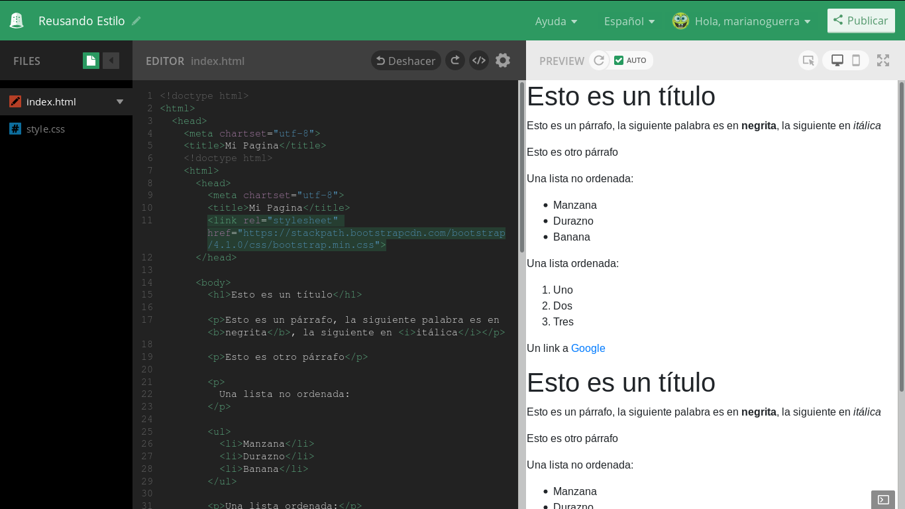
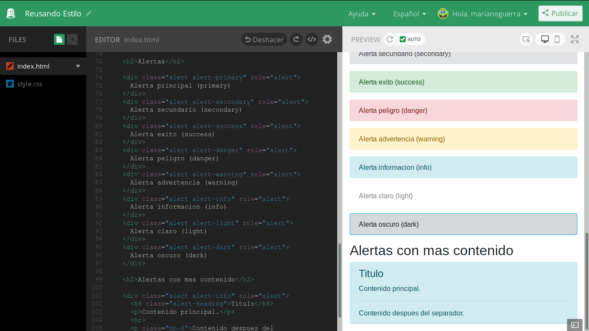

Reusando estilo (de otros)
==========================

En las secciones anteriores aprendimos como reusar el estilo guardándolo en un archivo separado y cargándolo en múltiples paginas.

A medida que vamos creando mas y mas paginas empiezan a surgir cosas comunes que se usan en casi cualquier proyecto.

Si miras con atención las paginas que visitas vas a ver que hay ciertos componentes que se repiten.

De esto te podrás imaginar que con tanto reusar estilos y llevarlos de un proyecto a otro a alguien se le habrá ocurrido la idea de hacer un archivo de estilos lo suficientemente genérico para que pueda ser el estilo inicial de mucha gente que quiere crear una pagina web nueva pero no quiere estar definiendo de cero todo cada vez que empieza.

Imaginas bien!

Hay varios, pero el mas conocido se llama bootstrap, y nos permite empezar nuestras paginas sin tener que preocuparnos por detalles que al fin del día no son tan importantes.

Mas interesante, es que como este proyecto estandariza los nombres de clases para cada estilo, hay gente que crea nuevos estilos que se cargan "sobre" bootstrap y que le cambian el aspecto sin que nosotros tengamos que hacer nada mas que agregar una linea a nuestro HTML!

Podes ver algunos ejemplos en https://bootswatch.com/

Incluyendo Bootstrap
--------------------

Vamos a ver como usar esto, empecemos con un proyecto nuevo en thimble con una
pagina básica:

.. code-block:: html

	<!doctype html>
	<html>
	  <head>
		<meta chartset="utf-8">
		<title>Mi Pagina</title>
	  </head>

	  <body>
		<h1>Esto es un título</h1>

		
Esto es un párrafo, la siguiente palabra es en <b>negrita</b>, la siguiente en <i>itálica</i>

		
Esto es otro párrafo

		

		  Una lista no ordenada:
		

		<ul>
		  <li>Manzana</li>
		  <li>Durazno</li>
		  <li>Banana</li>
		</ul>

		
Una lista ordenada:

		<ol>
		  <li>Uno</li>
		  <li>Dos</li>
		  <li>Tres</li>
		</ol>

		
Un link a <a href="https://google.com">Google</a>

	  </body>
	</html>

Nuestra pagina de siempre, no muy linda de ver:

.. figure:: ../galleries/cew/6/01-base.png

Ahora agregamos la hoja de estilo de bootstrap en el <head> de la pagina,
debajo del tag <title>:

.. code-block:: html

	<link rel="stylesheet" href="https://stackpath.bootstrapcdn.com/bootstrap/4.1.0/css/bootstrap.min.css">

Y podemos ver que ya cambio un poco:

Un tour por algunos componentes de bootstrap
--------------------------------------------

Pero si fuera solo por eso entonces no seria tan útil, esto es solo el
contenido base, bootstrap nos provee con muchos componentes estandard para
usar, empecemos por las alertas:

Alertas
.......

Agreguemos el siguiente HTML al <body> de nuestro proyecto:

.. code-block:: html

	<h2>Alertas</h2>

	

	  Alerta principal (primary)
	

	

	  Alerta secundario (secondary)
	

	

	  Alerta exito (success)
	

	

	  Alerta peligro (danger)
	

	

	  Alerta advertencia (warning)
	

	

	  Alerta informacion (info)
	

	

	  Alerta claro (light)
	

	

	  Alerta oscuro (dark)
	

	<h2>Alertas con mas contenido</h2>

	

	  <h4 class="alert-heading">Titulo</h4>
	  
Contenido principal.

	  

	  
Contenido despues del separador.

	

Debería verse algo así:

Badges
------

Badges se traduce a medalla o distintivo, es mas fácil entender que son
viéndolos que por la palabra, así que agreguemos el siguiente HTML a nuestra
pagina:

.. code-block:: HTML

    <h2>Badges</h2>

    <h3>Estandar</h3>

    

      Principal
      Secundario
      Exito
      Peligro
      Advertencia
      Informacion
      Claro
      Oscuro
    

    <h3>Pill Badges (Pastillas)</h3>
    
    

      Principal
      Secundario
      Exito
      Peligro
      Advertencia
      Informacion
      Claro
      Oscuro
    

    <h3>Links</h3>
    
    

      <a href="#" class="badge badge-primary">Principal</a>
      <a href="#" class="badge badge-secondary">Secundario</a>
      <a href="#" class="badge badge-success">Exito</a>
      <a href="#" class="badge badge-danger">Peligro</a>
      <a href="#" class="badge badge-warning">Advertencia</a>
      <a href="#" class="badge badge-info">Informacion</a>
      <a href="#" class="badge badge-light">Claro</a>
      <a href="#" class="badge badge-dark">Oscuro</a>
    

Como veras rodeo los ejemplos con un div para darle mas margen, pero no uso
style="margin: ..." como hasta acá, sino que uso una clase que bootstrap provee
que estandariza los margenes en 6 niveles (m-0, m-1, ..., m-5). De esta manera
si usamos estas clases en nuestras paginas los margenes serán consistentes y
luego podremos ajustarlos en un solo lugar (la definición de .m-0, ..., .m-5 en
nuestra hoja de estilos)

El resultado es algo así:

.. figure:: ../galleries/cew/6/04-badges.png

Barra de Navegacion
...................

Otro componente muy útil y versátil son las barras de navegación, suelen usarse
en la parte superior de la pagina y en cualquier sección que tiene mas de un
elemento para mostrar, como los tabs del navegador web.

.. code-block:: html

  <h2>Barra de Navegacion</h2>
  
  <h3>Usando tags de lista</h3>

  <ul class="nav">
    <li class="nav-item">
      <a class="nav-link active" href="#">Activo</a>
    </li>
    <li class="nav-item">
      <a class="nav-link" href="#">Link</a>
    </li>
    <li class="nav-item">
      <a class="nav-link" href="#">Link</a>
    </li>
    <li class="nav-item">
      <a class="nav-link disabled" href="#">Inactivo</a>
    </li>
  </ul>
    
  <h3>Usando el tag nav</h3>
    
  <nav class="nav">
    <a class="nav-link active" href="#">Activo</a>
    <a class="nav-link" href="#">Link</a>
    <a class="nav-link" href="#">Link</a>
    <a class="nav-link disabled" href="#">Inactivo</a>
  </nav>
    
  <h3>Justificado al centro</h3>

  <nav class="nav justify-content-center">
    <a class="nav-link active" href="#">Activo</a>
    <a class="nav-link" href="#">Link</a>
    <a class="nav-link" href="#">Link</a>
    <a class="nav-link disabled" href="#">Inactivo</a>
  </nav>
    
  <h3>Justificado a la derecha</h3>

  <nav class="nav justify-content-end">
    <a class="nav-link active" href="#">Activo</a>
    <a class="nav-link" href="#">Link</a>
    <a class="nav-link" href="#">Link</a>
    <a class="nav-link disabled" href="#">Inactivo</a>
  </nav>
    
  <h3>Tabs</h3>

  <nav class="nav nav-tabs">
    <a class="nav-link active" href="#">Activo</a>
    <a class="nav-link" href="#">Link</a>
    <a class="nav-link" href="#">Link</a>
    <a class="nav-link disabled" href="#">Inactivo</a>
  </nav>

  <h3>Pills</h3>

  <nav class="nav nav-pills">
    <a class="nav-link active" href="#">Activo</a>
    <a class="nav-link" href="#">Link</a>
    <a class="nav-link" href="#">Link</a>
    <a class="nav-link disabled" href="#">Inactivo</a>
  </nav>
    
  <h3>Tabs Expandidas (Lista)</h3>

  <ul class="nav nav-tabs nav-fill">
    <li class="nav-item">
      <a class="nav-link active" href="#">Activo</a>
    </li>
    <li class="nav-item">
      <a class="nav-link" href="#">Link</a>
    </li>
    <li class="nav-item">
      <a class="nav-link" href="#">Link</a>
    </li>
    <li class="nav-item">
      <a class="nav-link disabled" href="#">Inactivo</a>
    </li>
  </ul>
    
  <h3>Pills Expandidas (Nav)</h3>

  <nav class="nav nav-pills nav-fill">
    <a class="nav-item nav-link active" href="#">Activo</a>
    <a class="nav-item nav-link" href="#">Link</a>
    <a class="nav-item nav-link" href="#">Link</a>
    <a class="nav-item nav-link disabled" href="#">Inactivo</a>
  </nav>

El resultado es algo así:

.. figure:: ../galleries/cew/6/05-nav.png

Luego de explorar los componentes copiando y pegando los ejemplos intenta
modificarlos, agregar mas items, eliminar algunos, reordenarlos etc.

Si te sentís aventurero, intenta mirar un ejemplo y luego tiperarlo por
completo solo mirando el ejemplo cuando te olvides de algo o algo no funcione.

Este ejercicio es una buena forma de memorizar los conceptos básicos y de ver
cuales partes pensabas que entendías pero todavía algún detalle se escapa.

